# School_District_Analysis
PyCitySchools with Pandas

  &nbsp;&nbsp;&nbsp;&nbsp;In this module we will be utilizing *Jupyter Notebook* and *Pandas* to assist in the creation of a District Analysis of High Schools, we'll be breaking down the performance of these high schools based upon their standardized test-scores for math/reading. From there we will break down the performance of each student, each school, Overall performance, and school-type performance. Furthermore, we will create data-tables to look for correlations in budget per school, budget per student, and performance by school size. Lastly, we will be exempting data due to academic dishonesty occurring at *Thomas High School* and the entirety of its 9th graders are the once to be excluded from the data. With this exemption, we will display the difference in scores and performance in the school so that the schoolboard has easily digestible data to make decisions upon.   

**1.District Summary:**
  -  &nbsp;&nbsp;&nbsp;&nbsp;Here we can notice there isnt much of a drastic change in District analsyis when exempting students, there isnt a large enough disparity in the total student count as well as, scores of students under the assumption there wasnt more academic dishonesty in student scores.  
   &nbsp;&nbsp;&nbsp;&nbsp;Original:   
   
   &nbsp;&nbsp;&nbsp;&nbsp;Exempted:   
   
   
**2.School Summary:**
   -  &nbsp;&nbsp;&nbsp;&nbsp;As we break down the data per school we canb egin to notice the devil in the details, *Thomas High School* performance is barely passing when including data of its 9th Graders. Afterward, once we'd exempted the entirety of their 9th grade students we see that the school performs better(the drastic difference in Overall Percentage Passing shows the impact of excluding data), ofcourse this data makes it biased if we had not included the orignal for comparison.  
   &nbsp;&nbsp;&nbsp;&nbsp;Original:   
   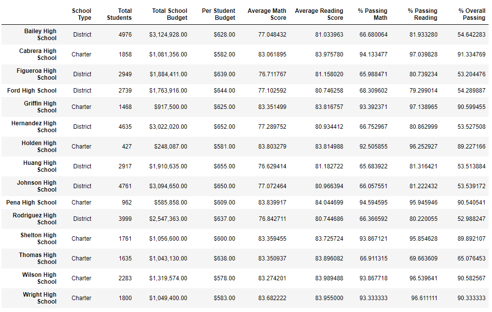
   &nbsp;&nbsp;&nbsp;&nbsp;Exempted:   
   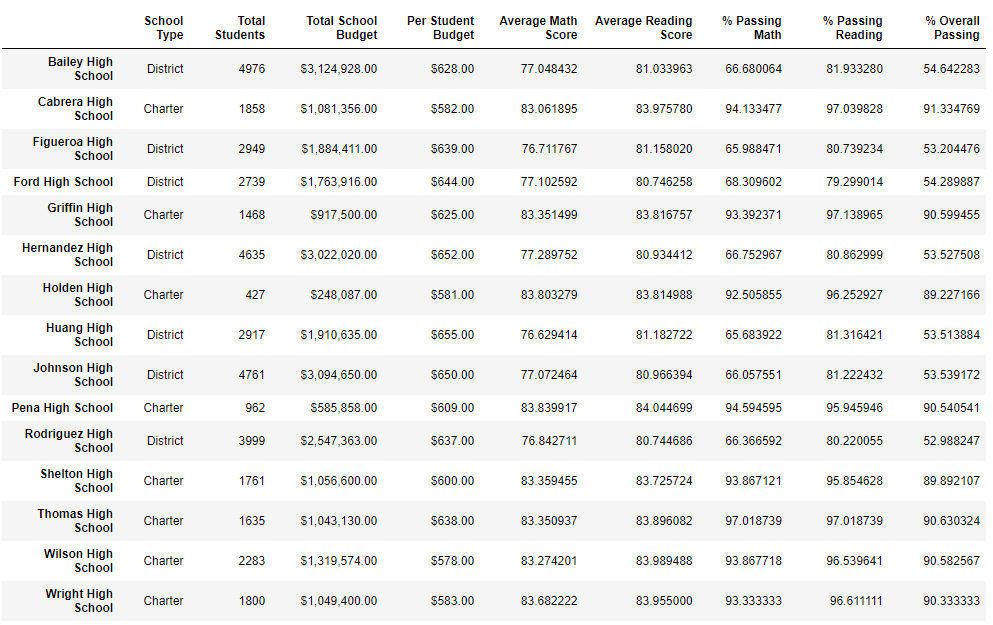

**3.Spending Per Student:**
   &nbsp;&nbsp;&nbsp;&nbsp;Overall, there were no major changes in spendinging per student as the number of exempted students is small and the difference in "spending per student isnt high enough to have a significant impact on the performance of the students. In fact, the data clecarly shows no clear correlation between spending per student as welll as, total budget having an impact on the schools performance for both math & reading.  

   &nbsp;&nbsp;&nbsp;&nbsp;Original:   
   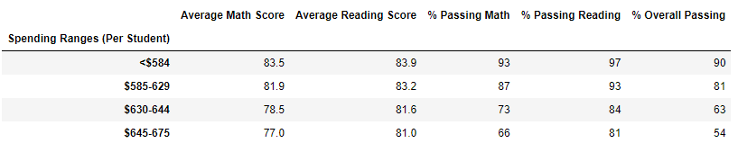
   &nbsp;&nbsp;&nbsp;&nbsp;Exempted:   
   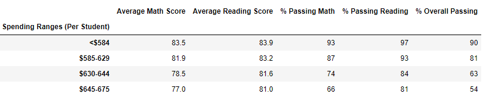

**4. Top 5 & Bottom 5:**

  &nbsp;&nbsp;&nbsp;&nbsp;Original Top 5:   
   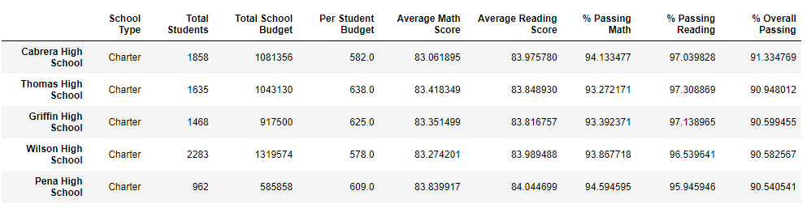
  &nbsp;&nbsp;&nbsp;&nbsp;Original Bottom 5:   
   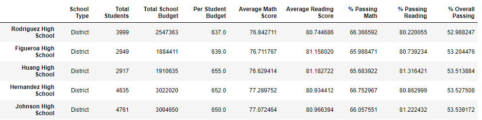

  &nbsp;&nbsp;&nbsp;&nbsp;Exempted Top 5:   
   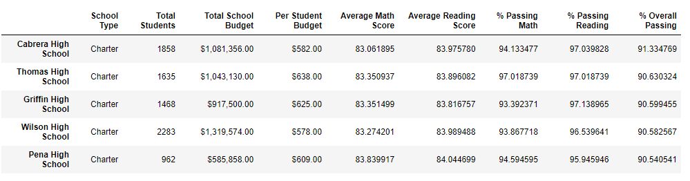
  &nbsp;&nbsp;&nbsp;&nbsp;Exempted Bottom 5:   
   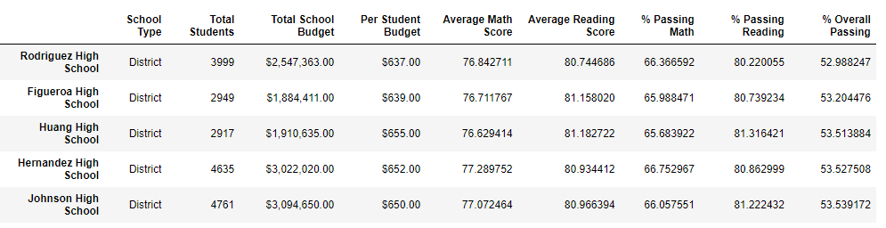
   
**5.School Size Scores:**

  &nbsp;&nbsp;&nbsp;&nbsp;Original School Size Scores:   
   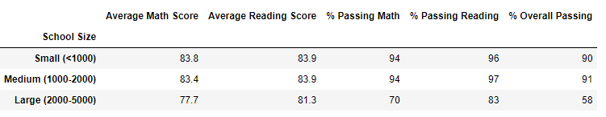
  &nbsp;&nbsp;&nbsp;&nbsp;Exempted School Size Scores:   
   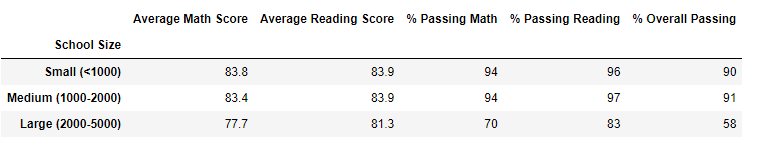

**6.School Type Scores:**
  &nbsp;&nbsp;&nbsp;&nbsp;Original School Type Scores:   
   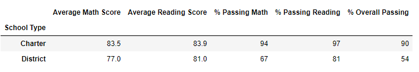
  &nbsp;&nbsp;&nbsp;&nbsp;Exempted School Type Scores:   
   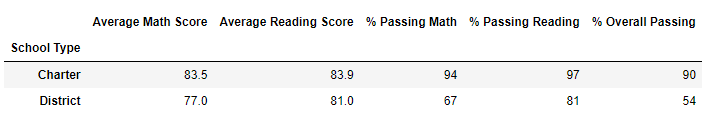

