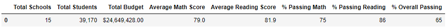

# School_District_Analysis
PyCitySchools with Pandas

**1.District Summary:**
  -  &nbsp;&nbsp;&nbsp;&nbsp;Here we can notice there isnt much of a drastic change in District analsyis when exempting students, there isnt a large enough disparity in the total student count as well as, scores of students under the assumption there wasnt more dishonesty in student scores.  
   &nbsp;&nbsp;&nbsp;&nbsp;Original:   
   
   &nbsp;&nbsp;&nbsp;&nbsp;Exempted:   
   
   
**2.School Summary:**
   &nbsp;&nbsp;&nbsp;&nbsp;Original:   
   
   &nbsp;&nbsp;&nbsp;&nbsp;Exempted:   
   
